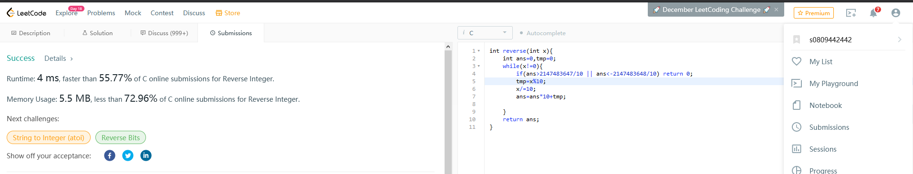

# 截圖
</img>

# Source Code
```c
int reverse(int x){
    int ans=0,tmp=0;
    while(x!=0){
        if(ans>2147483647/10 || ans<-2147483648/10) return 0;
        tmp=x%10;
        x/=10;
        ans=ans*10+tmp;
    }
    return ans;
}
```

# 解釋
本題要求將一個整數倒轉回去輸出，想法是用一個整數ans存取正確答案(line2)，第一次將原本的最後一位數用mod取出來，放到答案裡面，下一次再用mod取出來，但是這次放進去的答案會把原本的ans*10，也就是將位數往前推一位，再把新mod出來的數字塞到最後面，直到原本的x為0就得到我們要的結果了(line3~9)，當然中間要判斷overflow(line4)，也就是當新的答案ans再往前推一位數是否會超過int的大小，超過就回傳0，沒有就繼續做。