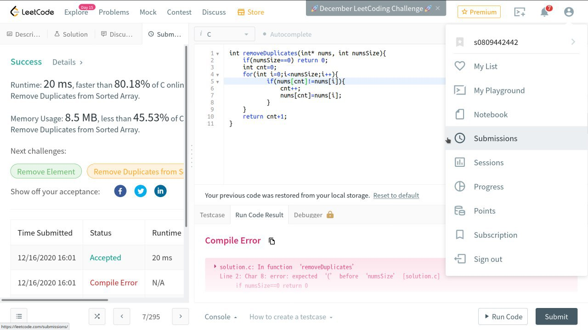

# 截圖
</img>

# Source Code
```c
int removeDuplicates(int* nums, int numsSize){
    if(numsSize==0) return 0;
    int cnt=0;
    for(int i=0;i<numsSize;i++){
           if(nums[cnt]!=nums[i]){
               cnt++;
               nums[cnt]=nums[i];
           }
    }
    return cnt+1;
}
```

# 解釋
本題要求將一個排序過的陣列實作成數字不重複的陣列，因此先將長度為0的情況做特判直接回傳長度0(line2)，再來用一個計數器(cnt)計算替換到第幾個數字(line3)，再來用for去遍歷整個陣列，如果第i項跟cnt項不一樣，那cnt項就會+1，並把cnt+1項替換成i的內容(line4~9)，最後回傳的就是總長度cnt+1(line10)。

一開始cnt=0,i=0,一定一樣，再來cnt=0,i=1，也就是說第0項跟第一項要是不一樣，就會先把cnt++，在把第1項換成第1項。

要是一樣則直接跳過，接著cnt=0，i=2，要是第2項跟第0項不一樣，就會cnt++，把第1項換成第2項的內容，由於前面確認過第0項跟第1項一樣，所以這樣的動作再把相同項消掉的同時也把不同的項往前移了，以此類推遍歷完整個陣列便能達到目的。