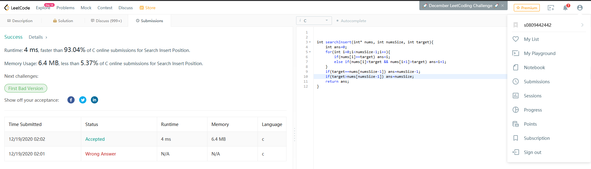

# 截圖
</img>

# Source Code
```c
int searchInsert(int* nums, int numsSize, int target){
    int ans=0;
    for(int i=0;i<numsSize-1;i++){
        if(nums[i]==target) ans=i;
        else if(nums[i]<target && nums[i+1]>target) ans=i+1;
    }
    if(target==nums[numsSize-1]) ans=numsSize-1;
    if(target>nums[numsSize-1]) ans=numsSize;
    return ans;
}
```

# 解釋
本題給定一個排序過的陣列，要求輸出給定target的index，如果不存在，則將該target放入陣列後應該在第幾個位置?W

設定答案變數為ans(Line2)，接著遍歷整個陣列直到size-2項(沒有第size項，size-1項不能跟第size項比大小)(Line3-6)，如果陣列第i項剛好等於target，ans設為該項項數(Line4)，如果第i項<target<第i+1項，則他應該插入到第i+1項，因此ans設為i+1(Line5)。

最後如果target=szie-1項則答案就是size-1(Line7)，如果target>size-1項，那他就應該被插入在第size項，所以ans為size(Line8)，最後回傳ans就好了(Line9)。