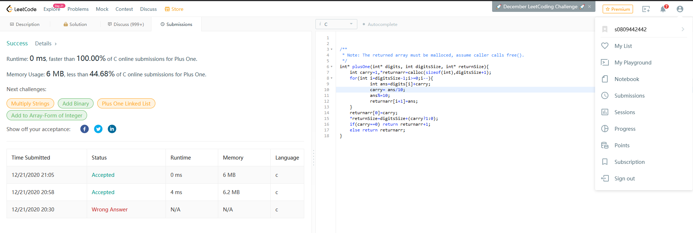

# 截圖
</img>

# Source Code
```c
int* plusOne(int* digits, int digitsSize, int* returnSize){
    int carry=1,*returnarr=calloc(sizeof(int),digitsSize+1);
    for(int i=digitsSize-1;i>=0;i--){
            int ans=digits[i]+carry;
            carry= ans/10;
            ans%=10;
            returnarr[i+1]=ans;
    }
    returnarr[0]=carry;
    *returnSize=digitsSize+(carry?1:0);
    if(carry==0) return returnarr+1;
    else return returnarr;
}
```
# 解釋
本題要求對代表一個整數中每位數的陣列+1，為了確保他不要一直進位到超過原本的長度，因此一開始給予digitalSize+1大小的returnarr(Line2)，我們將原本digits[i]+1後的結果會存在returnarr的第i+1項，接著去遍歷整個digits(Line3)，把digits+前一位的進位(carry)得到ans(Line4)，ans/10由於都是整數，大於10會得到1，小於10會得到0，這樣carry便是代表digits[i]的進位(Line5)，接著把ans取餘數，把進位的部分消除(Line6)，得到的ans便是returnarr[i+1]位的答案(Line7)，最後把原本保留的returnarr[0]設為carry(Line9)，前1位是0那他就是0，是1他就是1，returnSize就是原本的長度在看有沒有多進一位，有的話+1沒有的話就不動(Line10)，最後回傳的returnarr 如果沒進位的話，就代表第0項沒東西，回傳的值便是returnarr+1的指標(Line11)，如果是1，也就是其他情況，就回傳returnarr第0項的指標，也就是returnarr(Line12);
