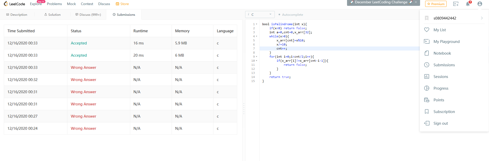

# 截圖
</img>

# Source Code
```c
bool isPalindrome(int x){
    if(x<0) return false; 
    int cnt=0,x_arr[32];
    while(x>0){         
        x_arr[cnt]=x%10;
        x/=10;
        cnt++;
    } 
    for(int i=0;i<cnt/2;i++){
        if(x_arr[i]!=x_arr[cnt-i-1]){
            return false;
        }
    }
    return true; 
}
```

# 解釋
本題要求判斷一個數字是不是回文數，我的想法是將數字轉換成陣列的各個位數(line4~8)，比較index第0個跟最後一個是不是一樣，第1個跟倒數第1個是不是一樣，以此類推，只要有一個不一樣就return false，全部一樣就return true(line9~14)，但是遇到負數，比如說-101，反過來就是101-，負號不可能在後面，也就是說負數永遠不可能是回文數，因此在開頭先把他判掉(line 2)。